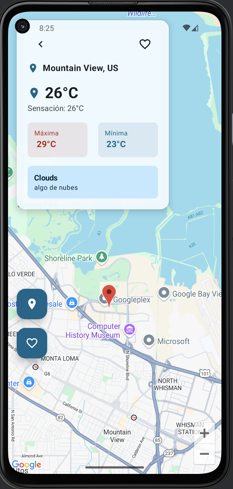
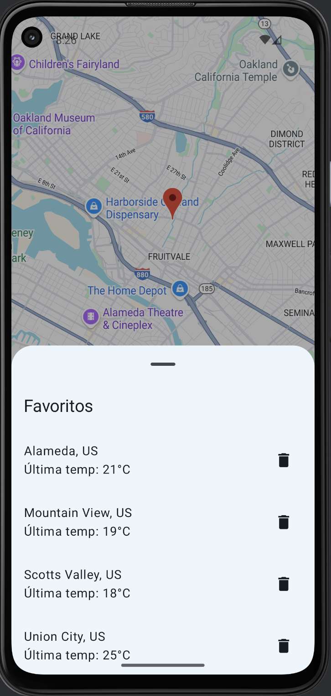
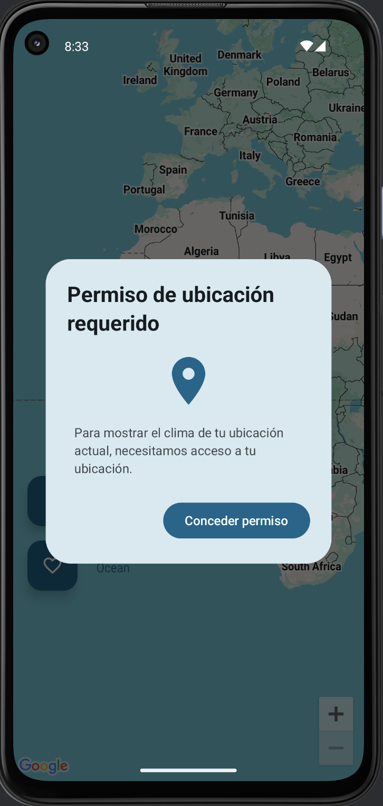

# Weatherstrix

Weatherstrix es una aplicación nativa para Android desarrollada en Kotlin utilizando Jetpack Compose. Permite consultar el clima actual de tu ubicación y de cualquier punto seleccionado en el mapa, integrando Google Maps y una API de pronóstico del clima. Además, puedes guardar ubicaciones favoritas para acceder rápidamente a su información meteorológica.

 ## Configuraciones claves necesarias:**
- Agrega tu clave de API de Google Maps en el archivo `local.properties` o en el `AndroidManifest.xml`.

## Arquitectura
]

## Tecnologías utilizadas
- **Kotlin**
- **Jetpack Compose** 
- **Material 3** 
- **ViewModel** 
- **Hilt** 
- **Room** 
- **Ktor** 
- **Google Maps** 

## Características principales
- Muestra el clima actual de tu ubicación automáticamente al abrir la app (si tienes permisos de ubicación).
- Permite seleccionar cualquier punto en el mapa para consultar el clima allí.
- Guarda y gestiona ubicaciones favoritas.
- Acceso rápido a favoritos desde el botón flotante.
- Persistencia local de favoritos para acceso offline.

